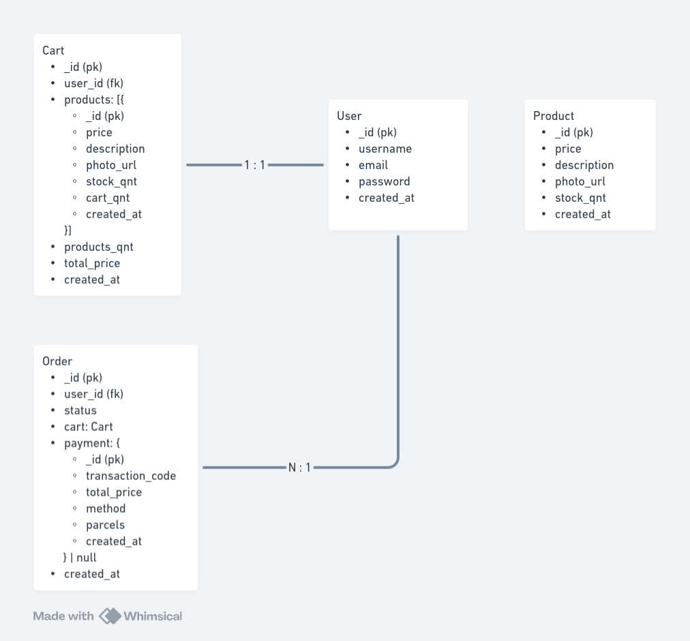

# API for an e-commerce platform

## Functional Requirements

- Ability for users to sign up and log in.
- Ability to add products to a cart.
- Ability to remove products from a cart.
- Ability to view and search for products.
- Ability for users to checkout and pay for products.
- Admin panel to add products, set the prices and manage inventory

## Non Functional Requirements

- Use asaas as payments gateway
- Use Next.js for build the frontend
- Use server-client architecture
- Use mongodb as database
- Use NodeJS and NestJS for backend

## Entities

- Users
- Products
- Carts
- Orders

## Architecture Diagram


## Entity–relationship model



## Features

### User

- login user (public)
- signup user (public)

### Product

- create product (admin)
- delete product (admin)
- update product (admin)
- list products (client)
- search products (client)

### Cart

- add products to cart (client)
- clear cart (client)
- remove product of cart (client)
- find current user cart (client)

### Order

- create order (client)
- cancel order (client)
- list current user orders (client)
- pay order (client)
- list orders (admin)
- search orders (admin)

## Running the project locally

### Requirements

- docker and docker compose

### 1. Setup .env file

Create a file called .env on project's root folder, and put something like this inside:

```
# Database
DB_HOST=localhost
DB_NAME=ecommerce
DB_USER=admin
DB_PASSWORD=admin
DB_PORT=27017

# Server
SERVER_URL=http://localhost:8080
SERVER_SECRET=your secret key

# Gateways
PAYMENT_GW_URL=https://sandbox.asaas.com/api/v3
PAYMENT_GW_KEY=your asaas key
```

### 2. Starting the services

Tu run in production mode just go to the project's root folder and run:

#### Production mode

```
docker compose up -d
```

#### Development mode (you can access the database on host machine)

```
docker compose -f docker-compose.dev.yml up -d
```

#### This will start the api on http://localhost:8080 and the database at the specified port on .env.

#### The database is empty, and you have to create a user with ADMIN role in the database for creating new products.

## Api Endpoints

You can access the postman documentation on **/docs/ecommerce-api.postman_collection.json** on root folder.

### Authentication

- POST /auth/signup
- POST /auth/login

### Products

- POST /products
- PUT /products
- GET /products
- DELETE /products/:productId

### Carts

- GET /carts/my-cart
- DELETE /carts/my-cart
- POST /carts/my-cart/products/:productId?quantity=1
- DELETE /carts/my-cart/products/:productId?quantity=1

### Orders

- GET /orders
- GET /orders/my-orders
- POST /orders/my-orders
- DELETE /orders/my-orders/:orderId

### Payments

- POST /payments/credit/orders/:orderId
